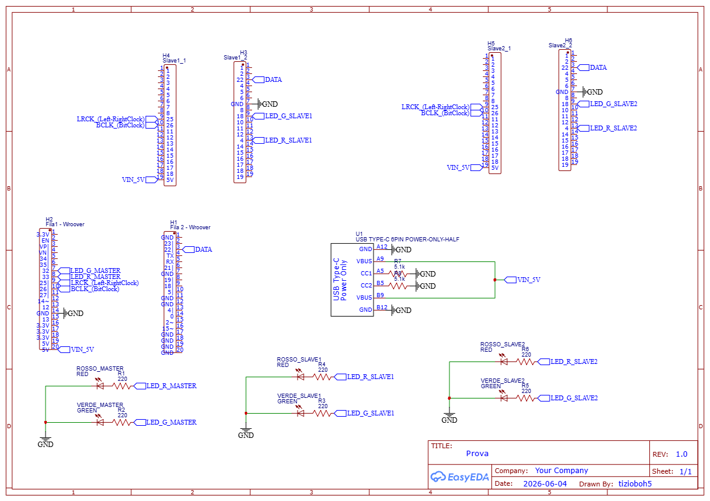

# BlueCatcher32

## Overview

Ever wondered if there's a way to share music with your friend's headphones? BlueCatcher32 is the solution i came with.

This program uses 3 Esp-32 boards to catch the Bluetooth music packets from your phones, and share it via I2S protocol with two pair of esp32, that then send them to two pairs of headphones via bluetooth. This way you can listen to music in real time with your friends.

## Dependencies

ESP32-A2DP from pschatzmann (downloadable via Library Manager from Arduino IDE)

Core ESP32 for Arduino (board manager — verify to have installed "ESP32 Dev Module" or equivalent)

## How it works:

The flow starts from the first esp-32, called master. This board creates a Bluetooth sink, and catches Bluetooth packets from your phone, then it resends it via cable with I2S protocol to the other 2 boards. In my case the master is a Esp-32 Wroover module from freenove, but you can also use just a regular esp-32.

The I2S protocol uses 3 cables to communicate:

* BCLK : Bit Clock 
* WS / LRCLK — Word Select : This signal tells us from wich channel is the data that is coming (Left or Right)
* DATA : Data of the packets

Each of the 2 secondary boards receives the audio over the I2S cable connection and stores it in memory using a DMA (Direct Memory Access) buffer. I used DMA to avoid burdening the CPU.

Then, the program creates a ring buffer of 32KB, a task writes the data from memory at the end of the buffer, then, the function get\_audio\_data() takes data when it needs it at the start of the buffer.

I used core 1 with max priority to ensure that the task which reads from the DMA buffer (i2s\_reader\_task) never falls behind. Otherwise, the DMA — which keeps writing data without stopping — would overwrite data that hasn't been copied into the bigger buffer yet.

I got helped by Claude for the slave code.

\## Hardware

I designed a custom PCB for this project using EasyEDA.

[EasyEDA_project](hardware/EasyEDA_files.json) - EasyEDA project file

[Schematic](hardware/Schematic.png) - Schematic

[PCB](hardware/PCB.png) - PCB layout

